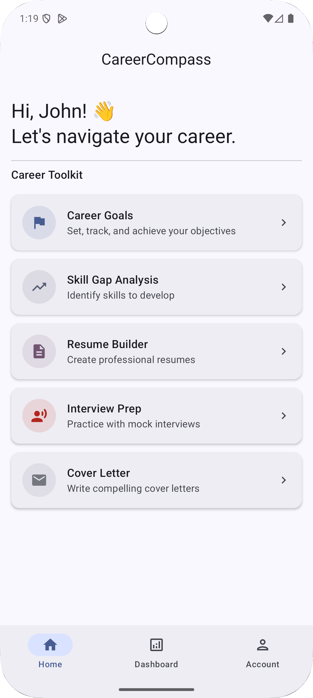
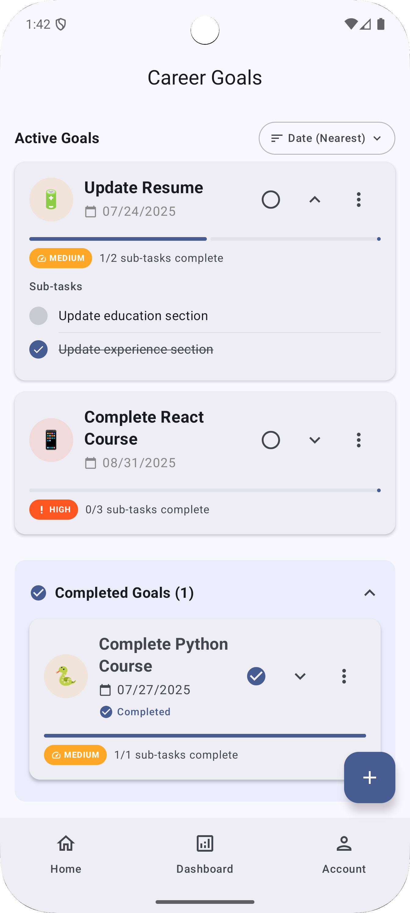
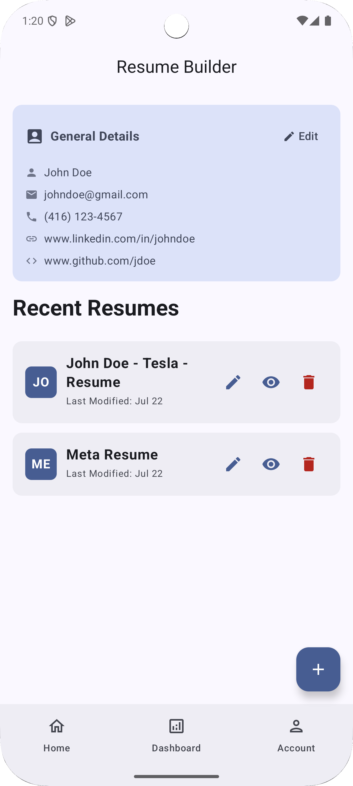
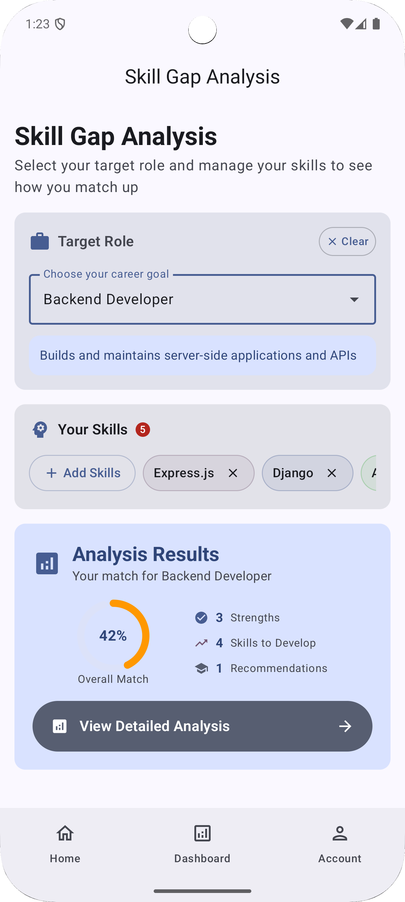
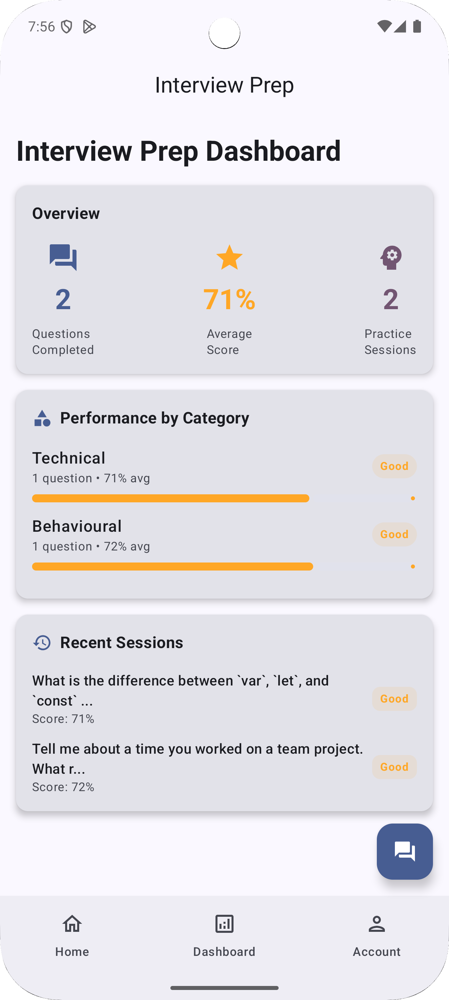
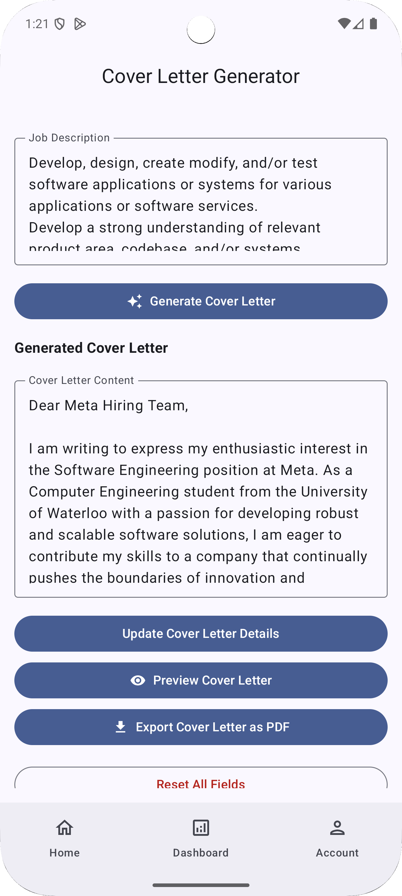
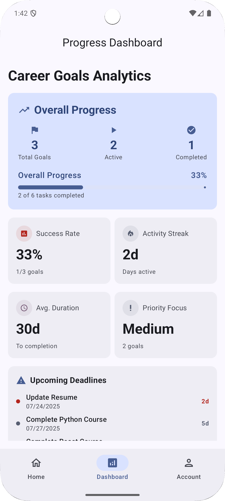
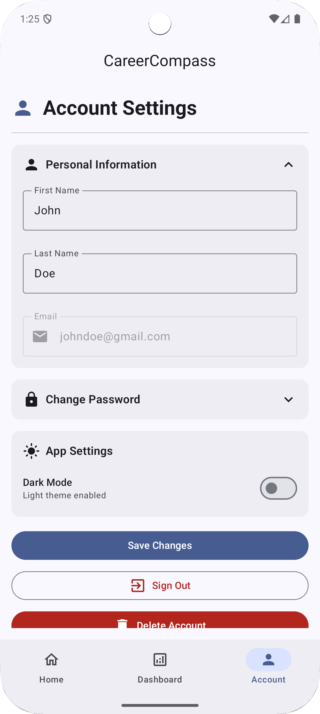

# CareerCompass

## Overview

CareerCompass is a comprehensive career development mobile application designed to empower professionals at every stage of their career journey. Built with modern Android development practices using Jetpack Compose and Kotlin, this app provides a complete toolkit for career advancement, from setting and tracking goals to building professional documents and preparing for interviews.

The app features an intuitive, Material Design 3-compliant interface that guides users through essential career development activities. Whether you're a recent graduate starting your professional journey, a mid-career professional looking to advance, or someone considering a career change, CareerCompass provides the tools and insights you need to succeed.

Core functionality includes intelligent career goal setting with progress tracking, comprehensive skill gap analysis, professional resume and cover letter generation, interview preparation with practice questions and AI generated feedback, and a personalized dashboard to monitor your career development progress. The app leverages Firebase for secure user authentication and cloud storage, ensuring your career data is accessible across devices while maintaining privacy and security.

## Features

### Career Goals & Planning
- Set SMART career objectives with deadline tracking
- Progress monitoring with visual indicators
- Goal prioritization and milestone management
- Automated reminders and notifications

### Skill Gap Analysis  
- Analysis of current skills vs. target roles
- Personalized learning resource recommendations
- Industry trend insights and skill demand forecasting
- Custom learning path generation

### Resume Builder
- Professional resume templates
- Dynamic content generation based on user input
- PDF export functionality with LaTeX-based formatting
- Multiple resume versions for different opportunities
- General details management for consistency across resumes

### Cover Letter Generator
- AI-powered cover letter creation
- Job-specific customization using resume data
- Professional formatting and structure
- Save and edit multiple versions

### Interview Preparation
- Curated interview question database by category
- Voice recording practice with AI feedback analysis
- Performance scoring and improvement suggestions
- STAR method guidance and evaluation

### Progress Dashboard
- Comprehensive career development tracking
- Goal completion statistics
- Skill improvement metrics
- Activity timeline and achievements

### Account Management
- Secure Firebase authentication
- Profile management and customization
- Dark/light theme preferences
- Password and security settings

## Screenshots

### Home Screen

### Career Goals

### Resume Builder

### Skill Gap Analysis

### Interview Prep

### Cover Letter Generator

### Dashboard

### Account Center

